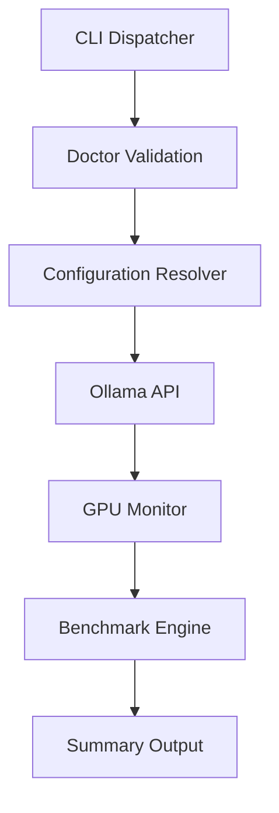

# AI Terminal Workspace

[](https://github.com/BabySuga/ai-terminal-workspace)
[](LICENSE)
[]()

A lightweight, developer-focused CLI toolkit and terminal workspace for local LLM inference, hardware telemetry monitoring, and streaming performance benchmarking.

---

## Quick Start

Run your first benchmark in under one minute:

```bash
git clone https://github.com/BabySuga/ai-terminal-workspace.git
cd ai-terminal-workspace
./scripts/install.sh
aiw doctor
aiw benchmark
```

---

## Preview

Placeholders reserved for screenshots and visual previews (located in `docs/images/`):


*_Placeholder: Screenshot of `aiw doctor` environment validation check_*


*_Placeholder: Screenshot of `aiw monitor gpu` hardware telemetry output_*


*_Placeholder: Screenshot of `aiw monitor ollama` runtime status output_*


*_Placeholder: Screenshot of `aiw benchmark` interactive TUI model selection_*


*_Placeholder: Screenshot of completed benchmark telemetry card_*

---

## Features

- **Environment Doctor**: Preflight validation of CLI dependencies, GPU drivers, ROCm, Ollama service, and endpoint config.
- **Unified Configuration**: Centralized endpoint resolver supporting CLI flags, environment variables, TOML config files, and fallbacks.
- **Hardware Telemetry**: Real-time monitoring of AMD GPU metrics (`amd-smi`) and Ollama server status.
- **Streaming LLM Benchmark**: Granular measurement for Time To First Token (TTFT), tokens/sec, response latency, and VRAM consumption.
- **Interactive TUI**: Terminal UI to select single or multiple models into sequential benchmark queues.
- **Modular CLI**: Zero-dependency Bash dispatcher (`aiw`) driving lightweight shell and Python modules.

---

## Requirements

| Requirement | Details |
| :--- | :--- |
| **OS** | Linux |
| **Shell** | Bash 4.0+ |
| **Python** | Python 3.11+ (uses built-in `tomllib`) |
| **Dependencies** | `jq`, `curl` |
| **Optional** | `ollama`, AMD GPU driver / ROCm (`amd-smi`, `rocminfo`) |

---

## Example Benchmark Result

The example below demonstrates a benchmark result captured on our reference workstation.

### Reference Workstation Environment

| Component | Specification |
| :--- | :--- |
| **OS** | Lubuntu 26.04 |
| **GPU** | AMD Radeon RX 9060 XT 16GB |
| **CPU** | Ryzen 5 5600G |
| **RAM** | 16 GB |
| **Backend** | ROCm |
| **Inference Engine** | Ollama |
| **Terminal** | Kitty |
| **Shell** | Bash |

### Result Output

```text
$ aiw benchmark qwen3:8b

Benchmark
────────────────────────

Model

qwen3:8b

Backend

ROCm

TTFT

842 ms

Generation Speed

72 tok/s

Latency

4.82 s

Prompt Tokens

24

Output Tokens

198

Approx Tokens

222

Characters

1056

Words

183

GPU

Utilization

99%

Peak VRAM

6.3 GB

Power

171 W

Edge

61°C

Hotspot

84°C

Memory

71°C
```

> [!NOTE]
> This is an example benchmark captured on the reference workstation under standard test conditions.

---

## Example Benchmark Comparison

The following table provides illustrative benchmark comparisons across common local model architectures.

| Model | Backend | TTFT | Gen Speed | Peak VRAM | Peak Power | Status |
| :--- | :--- | :--- | :--- | :--- | :--- | :--- |
| `qwen3:8b` | ROCm | 842 ms | 72 tok/s | 6.3 GB | 171 W | Sample |
| `hermes3:8b` | ROCm | 865 ms | 68 tok/s | 6.4 GB | 175 W | Sample |
| `deepseek-coder:6.7b` | ROCm | 720 ms | 81 tok/s | 5.2 GB | 165 W | Sample |
| `qwen2.5-coder:7b` | ROCm | 780 ms | 76 tok/s | 5.8 GB | 168 W | Sample |
| `qwen2.5vl:7b` | ROCm | 910 ms | 62 tok/s | 6.7 GB | 178 W | Sample |

> [!NOTE]
> All table values are sample data provided for illustrative purposes. Actual benchmark results depend on hardware specifications, model quantization, prompt length, and system runtime conditions.

---

## Benchmark Metrics

- **TTFT (Time To First Token)**: Elapsed duration from prompt transmission until receiving the first streamed token response from the inference engine.
- **Generation Speed**: Average token generation throughput during the completion phase, measured in tokens per second (tok/s).
- **Latency**: Total elapsed execution time for the full benchmark request from initiation to completion.
- **Peak VRAM**: Maximum dedicated GPU video memory allocated during inference execution.
- **Power Draw**: Peak GPU power consumption in Watts recorded by hardware sensors during active benchmarking.
- **GPU Utilization**: Highest observed percentage of GPU compute engine capacity utilized during model execution.
- **Prompt Tokens**: Number of input tokens included in the benchmark prompt payload processed by the model.
- **Output Tokens**: Total count of generated output completion tokens produced by the model.
- **Approx Tokens**: Combined total of prompt input tokens and generated output tokens processed during the benchmark run.
- **Characters**: Total character count contained in the model's generated text response.
- **Words**: Total word count contained in the model's generated text response.

---

## Architecture

```
CLI
 └─► Doctor
      └─► Configuration Resolver
           └─► Ollama API
                ├─► GPU Monitor
                └─► Benchmark Engine
                     └─► Summary
```

### Pipeline Diagram



---

## Repository Structure

```
ai-terminal-workspace/
├── assets/         # Static graphic assets and badges
├── benchmark/      # Streaming LLM benchmark engine and interactive TUI script
├── bin/            # Executable CLI binary dispatcher (aiw)
├── config/         # Endpoint resolution logic (TOML/ENV/CLI) and prompt templates
├── docs/           # Architecture specs, schemas, roadmap, and screenshot assets
├── examples/       # Usage examples and configuration snippets
├── monitor/        # Hardware telemetry (amd-smi) and Ollama runtime monitor scripts
├── scripts/        # Dispatcher modules, installation script, and doctor preflight checks
└── workspace/      # Terminal workspace layouts and session utilities
```

---

## Usage Examples

### Doctor
```bash
aiw doctor
```

### Configuration Management
```bash
aiw config init
aiw config show
aiw config test
aiw config set endpoint http://127.0.0.1:11434
```

### Telemetry Monitoring
```bash
# Monitor AMD GPU telemetry
aiw monitor gpu

# Monitor Ollama server state and loaded models
aiw monitor ollama
```

### Benchmarking
```bash
# Benchmark a single model
aiw benchmark qwen3:8b

# Benchmark multiple models sequentially
aiw benchmark qwen3:8b hermes3:8b

# Execute repeated benchmark runs
aiw benchmark --repeat 3 qwen3:8b

# Benchmark all installed models
aiw benchmark --all

# Launch interactive TUI benchmark selector
aiw benchmark
```

---

## Endpoint Configuration Hierarchy

The endpoint resolver resolves the Ollama API server address according to the following priority:

1. `--endpoint <url>` *(CLI argument override)*
2. `AIW_OLLAMA_ENDPOINT` *(AIW environment variable)*
3. `OLLAMA_HOST` *(Standard Ollama environment variable)*
4. `~/.config/aiw/config.toml` *(User configuration file)*
5. `http://127.0.0.1:11434` *(Default fallback endpoint)*

---

## Roadmap

### Current (v0.1.0)

- [x] **Doctor**: Preflight environment and dependency validation
- [x] **Configuration**: Multi-tier endpoint configuration resolver
- [x] **GPU Monitor**: Real-time AMD GPU telemetry via `amd-smi`
- [x] **Ollama Monitor**: Server runtime status and loaded model inspection
- [x] **Streaming Benchmark**: Granular TTFT, token throughput, and GPU telemetry capture
- [x] **Interactive Benchmark**: TUI mode for model queue selection

### Future

- [ ] **Benchmark History**: Persistent logging of benchmark runs
- [ ] **Model Comparison**: Side-by-side performance diffing
- [ ] **Markdown Report**: Automated benchmark summary export to Markdown
- [ ] **CSV Export**: Export benchmark telemetry datasets to CSV
- [ ] **HTML Report**: Rich standalone visual HTML report generation
- [ ] **tmux Workspace**: Integrated multi-pane terminal workspace launcher
- [ ] **Grafana Integration** *(optional)*: Real-time dashboard integration
- [ ] **Prometheus Integration** *(optional)*: Metrics exporter endpoint

---

## Contributing

Contributions are welcome! Please open an issue or submit a pull request for improvements and bug fixes.

---

## License

This project is licensed under the [MIT License](LICENSE).
