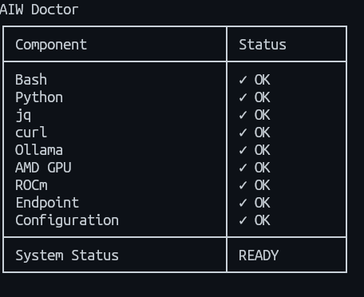
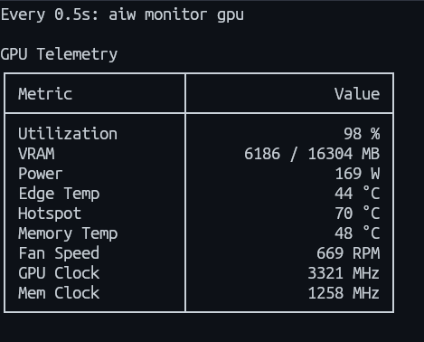
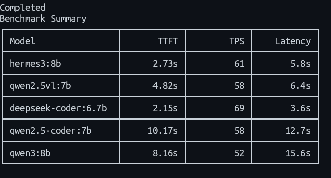

# AI Terminal Workspace

[](https://github.com/BabySuga/ai-terminal-workspace)
[](LICENSE)
[]()
[]()

AI Terminal Workspace is a lightweight CLI toolkit for validating, monitoring, and benchmarking local LLM deployments running on Ollama.

---

## Quick Start

Get up and running with your first benchmark in under one minute:

```bash
git clone https://github.com/BabySuga/ai-terminal-workspace.git
cd ai-terminal-workspace
./scripts/install.sh
aiw doctor
aiw benchmark
```

---

## Why This Project Exists

Running local LLMs effectively usually requires juggling multiple disconnected terminal tools and scripts.

Developers and AI engineers often find themselves switching between:
- `amd-smi` / `nvidia-smi` for hardware telemetry
- `ollama ps` for active model instances
- `btop` / `htop` for system resources
- `sensors` for thermal monitoring
- `curl` for manual endpoint validation
- Custom single-use benchmarking scripts

**AI Terminal Workspace** combines these workflows into a single, cohesive CLI designed specifically for local LLM workstations.

---

## Features

| Feature | Description |
| :--- | :--- |
| **Doctor** | Validates system environment, dependencies, GPU drivers, and Ollama service connectivity. |
| **Configuration** | Hierarchical priority resolver for endpoints across CLI flags, env vars, TOML config, and defaults. |
| **GPU Monitoring** | Real-time AMD GPU hardware telemetry capture using `amd-smi`. |
| **Ollama Monitoring** | Detailed inspection of local Ollama server runtime state and currently loaded models. |
| **Streaming Benchmark** | High-precision streaming benchmark measuring TTFT, generation speed, total latency, and peak VRAM. |
| **Interactive Benchmark** | TUI multi-select model picker with interactive queue execution. |
| **Multi-model Queue** | Sequential benchmark runner across multiple selected or all installed models. |
| **Repeat Benchmark** | Statistical repeat benchmark runner (`--repeat N`) for consistent average scoring. |

---

## Design Philosophy

Engineered specifically for local AI developers who demand speed, minimalism, and reliability:

| Principle | Rationale |
| :--- | :--- |
| **CLI-first** | Native terminal workflow with zero web overhead or complex GUIs. |
| **Lightweight** | Pure Bash & Python standard library; zero heavyweight external framework dependencies. |
| **No background daemon** | Operates strictly on-demand without lingering background processes or memory footprints. |
| **No database** | Simple file-based and stdout operations; no external database setup or migrations required. |
| **No telemetry** | 100% private and local; zero telemetry or analytics collected. |
| **Reuse Linux tooling** | Leverages established native tools (`amd-smi`, `curl`, `jq`) instead of reinventing hardware access. |
| **Human-readable output** | Clean, formatted terminal tables and summary cards for instant visual scanning. |
| **JSON output** | Built-in JSON formatting support for seamless script integration and pipeline automation. |

---

## Preview

> [!NOTE]
> Screenshot placeholders reserved in `docs/images/`. Visual previews will be updated after future release builds.

- `doctor.png` – Environment and dependency preflight check
- `gpu-monitor.png` – AMD GPU hardware telemetry monitoring
- `ollama-monitor.png` – Ollama server runtime status and loaded models
- `interactive-benchmark.gif` – TUI model selection and queue execution
- `benchmark-summary.png` – Final benchmark performance output







---

## Reference AI Workstation

Baseline benchmarks and hardware verification are conducted on the following reference workstation:

| Environment | Specification |
| :--- | :--- |
| **OS** | Lubuntu 26.04 |
| **GPU** | AMD Radeon RX 9060 XT 16GB |
| **CPU** | Ryzen 5 5600G |
| **RAM** | 16 GB |
| **Backend** | ROCm |
| **Inference Engine** | Ollama |
| **Terminal** | Kitty |
| **Shell** | Bash |

---

## Installed Models

Inventory of models installed on the reference AI workstation:

| Model | Category | Purpose | Status |
| :--- | :--- | :--- | :--- |
| `qwen3:8b` | General LLM | General reasoning, task completion, and primary benchmark target | Installed |
| `hermes3:8b` | Instruction | Multi-turn conversation and complex instruction adherence | Installed |
| `deepseek-coder:6.7b` | Code Generation | Code completion, inline synthesis, and technical problem solving | Installed |
| `qwen2.5-coder:7b` | Code Generation | Software engineering tasks and polyglot code generation | Installed |
| `qwen2.5vl:7b` | Vision-Language | Multimodal vision analysis and document OCR | Installed |
| `nomic-embed-text` | Embedding | Text embeddings and semantic vector retrieval indexing | Installed |

---

## Example Benchmark

Real benchmark results captured on the reference workstation using `qwen3:8b`:

```text
Benchmark
────────────────────────

Model
qwen3:8b

Backend
ROCm

TTFT
2.12 s

Generation Speed
50 tok/s

Latency
11.8 s

GPU
Peak VRAM
6.2 GB

Peak Power
131 W

Output
Characters
2326

Words
395

Approx Tokens
487
```

> [!IMPORTANT]
> The benchmark output above was collected directly on the reference AI workstation.
> Real-world benchmark performance depends on your specific GPU hardware, power limits, thermal throttling, quantization, and warm/cold model state.

---

## Benchmark Comparison

Comparison matrix across local models (untested models marked as `Pending`):

| Model | Backend | TTFT | TPS | Peak VRAM | Status |
| :--- | :--- | :--- | :--- | :--- | :--- |
| `qwen3:8b` | ROCm | 2.12 s | 50 tok/s | 6.2 GB | Completed |
| `hermes3:8b` | ROCm | Pending | Pending | Pending | Pending |
| `deepseek-coder:6.7b` | ROCm | Pending | Pending | Pending | Pending |
| `qwen2.5-coder:7b` | ROCm | Pending | Pending | Pending | Pending |
| `qwen2.5vl:7b` | ROCm | Pending | Pending | Pending | Pending |
| `nomic-embed-text` | ROCm | Pending | Pending | Pending | Pending |

---

## Benchmark Metrics

Key performance indicators tracked during benchmark execution:

### Inference Metrics
- **TTFT**: Time To First Token measures elapsed time from prompt submission to receiving the first token.
- **Generation Speed**: Measures average token generation throughput in tokens per second.
- **Latency**: Measures total round-trip execution duration from initiation to final completion.

### GPU Telemetry Metrics
- **Peak VRAM**: Measures maximum video memory consumed by the GPU during benchmark execution.
- **GPU Utilization**: Measures peak GPU compute core usage percentage recorded during inference.
- **Power Draw**: Measures maximum GPU electrical power consumption in Watts during active benchmarking.
- **Temperature**: Measures maximum GPU core temperature recorded during active benchmark execution.

### Output Metrics
- **Prompt Tokens**: Counts input tokens in the benchmark prompt payload processed by the model.
- **Output Tokens**: Counts total completion tokens generated by the model.
- **Approx Tokens**: Represents the combined total of prompt input tokens and output tokens.
- **Characters**: Counts total character length of the generated completion text response.
- **Words**: Counts total word count contained in the generated completion text response.

---

## CLI Examples

Comprehensive command reference for day-to-day operations:

```bash
# Environment Diagnostics
aiw doctor
aiw version

# Configuration Management
aiw config init
aiw config show
aiw config test

# Hardware & Service Monitoring
aiw monitor gpu
aiw monitor ollama

# Model Benchmarking
aiw benchmark
aiw benchmark qwen3:8b
aiw benchmark qwen3:8b hermes3:8b
aiw benchmark --all
aiw benchmark --repeat 3 qwen3:8b
```

---

## Architecture

High-level request dispatch and telemetry pipeline architecture:

```
CLI
 ↓
Doctor
 ↓
Configuration Resolver
 ↓
Ollama API
 ↓
GPU Monitor
 ↓
Benchmark Engine
 ↓
Summary
```

---

## Repository Structure

Overview of the top-level repository directories and modules:

| Directory | Description |
| :--- | :--- |
| `assets/` | Static graphic assets and project badges. |
| `benchmark/` | Streaming benchmark engine and interactive TUI script handler. |
| `bin/` | Executable CLI binary launcher (`aiw`). |
| `config/` | Endpoint configuration resolver and default prompt template files. |
| `docs/` | Architecture specs, schemas, graphic assets, and release guidelines. |
| `examples/` | Configuration snippets and output report examples. |
| `monitor/` | AMD GPU telemetry (`amd-smi`) and Ollama monitoring scripts. |
| `scripts/` | Modular command handlers and doctor preflight check scripts. |
| `workspace/` | Terminal workspace layout files and session templates. |

---

## Roadmap

Development roadmap toward a production-grade workstation toolkit:

```
v0.1                  v0.2                     v0.3                  v1.0
[Doctor]         ──►  [Benchmark History] ──►  [Workspace]      ──►  [Production-Ready]
[Configuration]       [Model Comparison]       [tmux Integration]    [AI Workstation]
[Monitoring]          [Markdown Report]        [Dashboard]           [Toolkit]
[Benchmark]           [CSV/HTML Export]
```

### Milestone Breakdown

- **v0.1 (Current Release)**
  - Doctor environment preflight check
  - Priority configuration resolver
  - GPU telemetry monitoring (`amd-smi`)
  - Ollama runtime monitoring
  - Streaming benchmark engine
  - Interactive TUI queue runner
- **v0.2 (Planned)**
  - Historical benchmark run tracking
  - Side-by-side model comparison reports
  - Automated Markdown, CSV, and HTML report export
- **v0.3 (Planned)**
  - Terminal workspace builder
  - Native `tmux` session layout integration
  - Interactive terminal dashboard UI
- **v1.0 (Target)**
  - Production-ready AI Workstation Toolkit

---

## Contributing

We welcome community contributions! To contribute:

1. Fork the repository
2. Create your feature branch (`git checkout -b feature/my-feature`)
3. Run `shellcheck` on changed shell scripts
4. Run `shfmt` to format code
5. Open a Pull Request

---

## Release Status

| Metric | Specification |
| :--- | :--- |
| **Current Release** | `v0.1.0` |
| **Status** | Stable |
| **Notice** | First public release |

> [!NOTE]
> `v0.1.0` marks the first official public release of AI Terminal Workspace.

---

## License

Distributed under the [MIT License](LICENSE).
