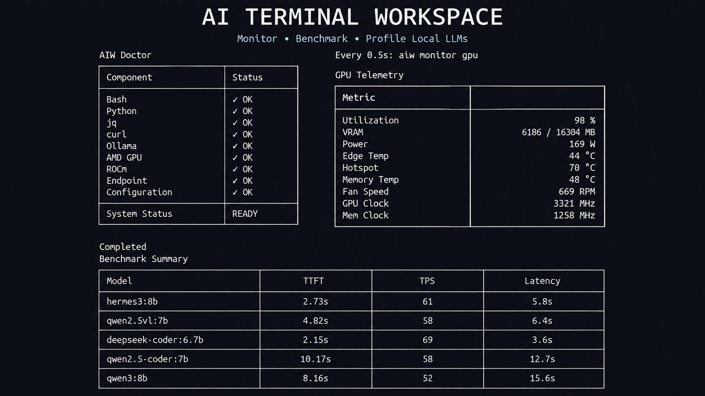

# AI Terminal Workspace

Monitor • Benchmark • Profile Local LLM Workstations

[](https://github.com/BabySuga/ai-terminal-workspace)
[](LICENSE)
[]()
[]()
[]()
[]()

---

## Preview

The screenshots and animated previews below demonstrate the unified command-line workflow for environment checks, real-time hardware telemetry, model state inspection, and interactive streaming benchmarks.



### Workflow Previews

- `docs/images/doctor.png` – Environment and dependency preflight diagnostics
- `docs/images/gpu-monitor.png` – Real-time AMD GPU hardware telemetry monitoring
- `docs/images/benchmark-summary.png` – Multi-metric model streaming benchmark results
- `docs/images/interactive.gif` – TUI model multi-selection and benchmark queue runner


---

## Quick Start

Get up and running with your first local LLM benchmark in less than a minute:

```bash
git clone https://github.com/BabySuga/ai-terminal-workspace.git
cd ai-terminal-workspace
./scripts/install.sh
aiw doctor
aiw benchmark
```

---

## Who Is This For?

| User | Why |
| :--- | :--- |
| **AI Engineers** | Rapidly benchmark model latency, Time-To-First-Token (TTFT), and generation throughput on local hardware. |
| **ML Engineers** | Profile VRAM utilization, GPU power draw, and thermal behavior across model architectures. |
| **Infrastructure Engineers** | Validate driver stacks, ROCm runtime status, and Ollama service health across Linux hosts. |
| **Linux Engineers** | Automate local LLM diagnostics and performance tracking using lightweight CLI utilities and JSON exports. |
| **Local LLM Enthusiasts** | Compare inference speeds and memory requirements across local models prior to production deployment. |

---

## Why This Project Exists

Running and profiling local LLMs usually requires juggling multiple disconnected terminal utilities and custom ad-hoc scripts.

### Traditional Disconnected Workflow

```text
amd-smi
   ↓
ollama ps
   ↓
btop
   ↓
sensors
   ↓
curl
   ↓
manual scripts
   ↓
collect metrics
   ↓
repeat
```

### AI Terminal Workspace Workflow

```text
AI Terminal Workspace
   ↓
one CLI
   ↓
complete workflow
```

---

## Why Not Just Use...

| Tool | Purpose | Advantage of AI Terminal Workspace |
| :--- | :--- | :--- |
| `ollama run` | Interactive LLM chat | AIW adds TTFT, TPS, peak VRAM, power telemetry, and automated prompt evaluation. |
| `ollama ps` | List active loaded models | AIW adds detailed model parameter sizing, context limits, and memory footprint inspection. |
| `amd-smi` | Raw GPU hardware statistics | AIW correlates hardware metrics directly with active LLM inference execution windows. |
| `btop` | General system monitoring | AIW delivers focused, AI-workload-specific metrics without terminal visual noise. |
| `curl` | Manual REST API validation | AIW streams API responses while parsing token metrics and generating comparative reports. |
| **AI Terminal Workspace** | **Unified Local AI Toolkit** | **Integrates preflight checks, GPU telemetry, and streaming benchmarks into one CLI.** |

---

## Feature Matrix

| Capability | Status |
| :--- | :---: |
| Doctor | ✅ |
| Configuration | ✅ |
| GPU Monitor | ✅ |
| Ollama Monitor | ✅ |
| Streaming Benchmark | ✅ |
| Interactive Benchmark | ✅ |
| Multiple Model Queue | ✅ |
| Repeat Benchmark | ✅ |
| JSON Output | ✅ |
| Remote Endpoint | ✅ |
| AMD GPU | ✅ |
| ROCm | ✅ |
| Linux | ✅ |
| NVIDIA GPU | 🚧 |
| vLLM | 🚧 |
| llama.cpp | 🚧 |

---

## Design Philosophy

Engineered specifically for local AI developers who demand speed, minimalism, and reliability:

- **CLI-first**: Native terminal workflow with zero web server overhead or complex GUIs.
- **Lightweight**: Pure Bash and Python standard library; zero heavyweight third-party framework dependencies.
- **No Daemon**: Operates strictly on-demand without lingering background processes or memory footprints.
- **No Database**: Simple file-based and stdout operations; no external database setup or migrations required.
- **No Telemetry**: 100% private and local; zero telemetry, tracking, or remote phone-home code.
- **Native Linux Tooling**: Leverages established native utilities (`amd-smi`, `curl`, `jq`) instead of custom drivers.
- **Reusable & Automation Friendly**: Supports clean JSON outputs and stdout formatting for shell piping and CI/CD pipelines.

---

## Reference Workstation

Baseline benchmarks and system verifications are conducted on the following local reference workstation:

| Component | Specification |
| :--- | :--- |
| **OS** | Lubuntu 26.04 |
| **GPU** | AMD Radeon RX 9060 XT 16GB |
| **CPU** | AMD Ryzen 5 5600G |
| **RAM** | 16 GB |
| **Backend** | ROCm |
| **Inference Engine** | Ollama |
| **Terminal** | Kitty |
| **Shell** | Bash |

---

## Installed Models

Inventory of models installed and verified on the reference workstation:

| Model | Category | Purpose | Status |
| :--- | :--- | :--- | :---: |
| `qwen3:8b` | General LLM | General reasoning, task completion, and primary benchmark target | Installed |
| `hermes3:8b` | Instruction | Multi-turn conversation and complex instruction adherence | Installed |
| `deepseek-coder:6.7b` | Code Generation | Code completion, inline synthesis, and technical problem solving | Installed |
| `qwen2.5-coder:7b` | Code Generation | Software engineering tasks and polyglot code generation | Installed |
| `qwen2.5vl:7b` | Vision-Language | Multimodal vision analysis and document OCR | Installed |
| `nomic-embed-text` | Embedding | Text embeddings and semantic vector retrieval indexing | Installed |

---

## Real Benchmark

> [!IMPORTANT]
> All benchmark metrics listed below were collected directly on the reference workstation using the `aiw benchmark` engine.

### Benchmark Comparison

| Model | Backend | TTFT | TPS | Latency | Peak VRAM | Peak Power | Status |
| :--- | :--- | :---: | :---: | :---: | :---: | :---: | :---: |
| `qwen3:8b` | ROCm | 2.09 s | 51 tok/s | 9.83 s | 6.13 GB | 124 W | Completed |
| `hermes3:8b` | ROCm | 4.26 s | 60 tok/s | 6.84 s | 11.15 GB | 57 W | Completed |
| `deepseek-coder:6.7b` | ROCm | 3.06 s | 66 tok/s | 4.49 s | 6.46 GB | 45 W | Completed |
| `qwen2.5-coder:7b` | ROCm | 4.29 s | 58 tok/s | 6.95 s | 11.22 GB | 70 W | Completed |
| `qwen2.5vl:7b` | ROCm | 5.09 s | 50 tok/s | 6.89 s | 7.25 GB | 44 W | Completed |
| `nomic-embed-text` | ROCm | Embedding Model | N/A | N/A | N/A | N/A | N/A |

### Detailed Telemetry & Output Metrics

| Model | Output Characters | Output Words | Approx Tokens | Idle VRAM | Peak VRAM | Idle Power | Peak Power |
| :--- | :---: | :---: | :---: | :---: | :---: | :---: | :---: |
| `qwen3:8b` | 1,881 | 323 | 391 | 554 MB | 6,134 MB | 7 W | 124 W |
| `hermes3:8b` | 772 | 131 | 154 | 6,158 MB | 11,154 MB | 9 W | 57 W |
| `deepseek-coder:6.7b` | 444 | 73 | 94 | 11,172 MB | 6,463 MB | 8 W | 45 W |
| `qwen2.5-coder:7b` | 737 | 131 | 153 | 6,471 MB | 11,217 MB | 9 W | 70 W |
| `qwen2.5vl:7b` | 462 | 80 | 90 | 11,242 MB | 7,245 MB | 9 W | 44 W |

---

## Benchmark Notes

- All benchmarks were collected sequentially on the reference workstation using default prompt configurations.
- Actual benchmark performance in end-user environments will vary based on:
  - **Hardware Architecture**: GPU core count, memory bandwidth, and bus interface.
  - **Quantization**: Model weight precision (e.g., Q4_K_M vs. FP16).
  - **Prompt Complexity**: Input context length and total generation length.
  - **GPU Clocks & Power**: Active clock frequencies and power limit caps.
  - **Thermal Conditions**: Thermal throttling thresholds and cooling efficiency.
  - **Cold vs. Warm State**: Initial cold load from storage into VRAM versus subsequent warm cached runs.

---

## Benchmark Metrics

### Inference Metrics
- **TTFT (Time To First Token)**: Measures latency from prompt submission until the first response token is returned.
- **Generation Speed (TPS)**: Measures average token throughput in tokens per second during stream completion.
- **Latency**: Total round-trip execution duration from request dispatch to output completion.

### GPU Telemetry Metrics
- **Peak VRAM**: Maximum video RAM allocated by the GPU driver during inference execution.
- **Peak Power**: Maximum electrical power consumption in Watts recorded during inference.
- **GPU Utilization**: Percentage of GPU compute core activity during benchmarking.
- **Temperatures**: Thermal levels recorded across GPU core and VRAM components.

### Output Metrics
- **Characters**: Total count of text characters contained in the model completion output.
- **Words**: Total word count in the generated response payload.
- **Approx Tokens**: Combined total estimate of prompt context and completion tokens.

### Future Metrics (Planned)
- **CPU Usage**: Host CPU utilization during model generation 🚧
- **RAM Usage**: System host memory consumption 🚧
- **GPU Clock**: Core engine frequency during inference 🚧
- **Memory Clock**: VRAM clock frequency 🚧
- **Fan RPM**: GPU cooling fan rotational speed 🚧
- **Context Length**: Total active context window size 🚧
- **Quantization**: Sizing and quantization scheme detection 🚧

---

## Workflow

```text
Developer
    │
    ▼
aiw benchmark
    │
    ▼
Interactive Menu
    │
    ▼
Queue
    │
    ▼
Benchmark
    │
    ▼
Collect Metrics
    │
    ▼
Summary
    │
    ▼
Future Reports
```

---

## Architecture

```text
           +----------------------+
                aiw CLI
           +----------------------+
                     │
     +---------------+---------------+
     │                               │
 Doctor                      Benchmark
     │                               │
 Config Resolver              Ollama API
     │                               │
 GPU Monitor             Streaming Parser
     │                               │
     +---------------+---------------+
                     │
               Summary Output
```

---

## Project Structure

```text
ai-terminal-workspace/
├── assets/                  # Project graphic assets and visual branding
├── benchmark/               # Benchmark execution engine and interactive TUI script
│   ├── ollama.sh            # Streaming Ollama API benchmark runner
│   └── tui.py               # Interactive multi-select model terminal UI
├── bin/                     # Executable CLI launcher entry point
│   └── aiw                  # Master CLI command dispatcher script
├── config/                  # Centralized configuration resolver and prompt templates
│   ├── prompts/             # Standardized benchmark evaluation prompts
│   │   └── default.txt      # Default benchmark prompt text
│   └── resolver.py          # Priority-based configuration resolver
├── docs/                    # Architecture specifications and documentation
│   ├── architecture.md      # High-level system architectural overview
│   ├── benchmark.md         # Detailed benchmark implementation spec
│   ├── images/              # Visual showcase screenshots and GIF previews
│   ├── monitoring.md        # Hardware and service telemetry specifications
│   ├── release-checklist.md # Production release verification procedures
│   ├── roadmap.md           # Multi-phase project development plan
│   └── schema.md            # JSON data output schemas
├── examples/                # Example configurations and output report samples
├── monitor/                 # Hardware and runtime monitoring scripts
│   ├── gpu.sh               # AMD GPU hardware telemetry capture via amd-smi
│   └── ollama.sh            # Ollama server runtime and model state inspector
├── scripts/                 # Core CLI command dispatchers and doctor preflight checks
│   ├── doctor/              # Modular dependency and health validation checks
│   ├── benchmark.sh         # Benchmark command dispatcher
│   ├── config.sh            # Configuration management dispatcher
│   ├── doctor.sh            # Doctor command orchestrator
│   ├── install.sh           # Project installer and symlink setup script
│   ├── monitor.sh           # Telemetry monitor dispatcher
│   ├── report.sh            # Report generation dispatcher
│   └── workspace.sh         # Terminal workspace dispatcher
├── workspace/               # Terminal workspace layout scripts and session handlers
├── LICENSE                  # Open source license (MIT)
└── README.md                # Project README and documentation
```

---

## Roadmap

```text
v0.1                  v0.2                     v0.3                  v1.0
[Doctor]         ──►  [Benchmark History] ──►  [Workspace]      ──►  [Production-Ready]
[Configuration]       [Model Comparison]       [tmux Integration]    [AI Workstation]
[Monitoring]          [Markdown Report]        [Dashboard]           [Toolkit]
[Benchmark]           [CSV/HTML Export]
```

### Milestone Breakdown

- **v0.1 (Current Release)**
  - Doctor environment preflight validation
  - Priority configuration resolver (CLI, Env, TOML, Defaults)
  - AMD GPU hardware telemetry capture (`amd-smi`)
  - Ollama service and loaded model monitoring
  - High-precision streaming benchmark engine
  - Interactive TUI queue runner
- **v0.2 (Planned)**
  - Historical benchmark run storage and tracking
  - Side-by-side comparative model performance reports
  - Markdown, CSV, and HTML report export engines
- **v0.3 (Planned)**
  - Interactive terminal workspace layout builder
  - Native `tmux` session layout integration
  - Real-time terminal dashboard TUI
- **v1.0 (Target)**
  - Production-ready AI Workstation Toolkit for Linux developers

---

## Project Goals

- **Current Goal**: Build a lightweight, reliable, and zero-dependency local AI benchmarking and monitoring CLI for Linux developers.
- **Future Goal**: Evolve into a production-ready, open-source AI workstation toolkit for local model deployment, profiling, and management.

---

## Release Status

| Property | Value |
| :--- | :--- |
| **Current Release** | `v0.1.0` |
| **Release Status** | Stable |
| **Target Architecture** | Linux (x86_64 / ROCm) |

---

## Contributing

Contributions are welcome! Please follow these steps:

1. Fork the repository
2. Create your feature branch (`git checkout -b feature/amazing-feature`)
3. Validate shell scripts with `shellcheck`
4. Format shell scripts with `shfmt`
5. Open a Pull Request

---

## License

Distributed under the [MIT License](LICENSE).
